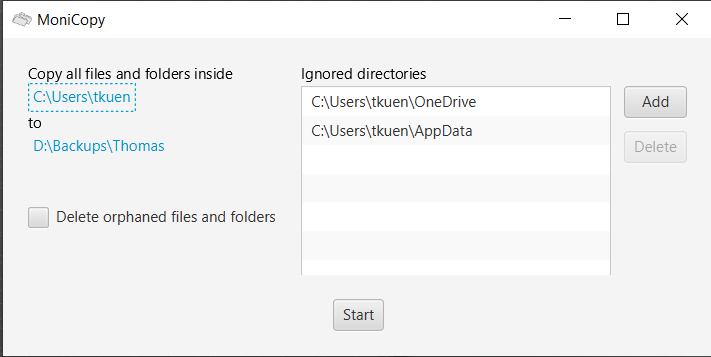

# Welcome

MoniCopy is an easy to use folder copy app written in Java and JavaFX. The app is released under the Apache-2.0 License. Its usage is quite simple:

- Pick source and destination directories
- Decide if you want to keep orphans (files that were once there, but no longer are)
- Choose directories to ignore (for example the local copy of cloud storage)
- Click **Start**

MoniCopy only copies new and changed files.

 

**Please note** that MoniCopy cannot access files that are currently in use.