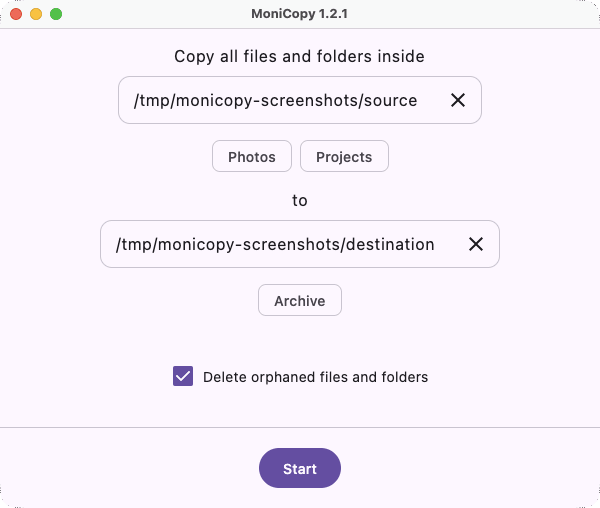

# Welcome

*MoniCopy* is an easy-to-use folder copy app for macOS and Windows built with Kotlin and Compose Desktop. The app is released under the Apache-2.0 License. Its usage is quite simple:

- Pick source and destination directories
- Choose directories to ignore (for example the local copy of cloud storage)
- Decide if you want to keep orphans (files that were once there, but no longer are)
- Click **Start**

MoniCopy only copies new and changed files.

### Known limitations

- MoniCopy cannot access files that are currently in use

### Gradle cheat sheet

- Run tests, including the Compose UI tests: `./gradlew test`
- Update the README screenshots and the animated GIF (macOS, needs screen recording and accessibility permission for the terminal): `scripts/capture-screenshots.sh`
